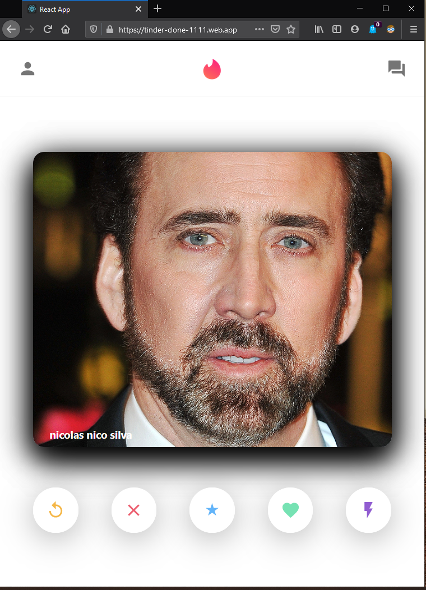

###   h e l l o !

## I'am Zi, and this is another M. E. R . N stack project

### This project is a clone of the tinder  interface  

### Its live runing on :  https://tinder-clone-1111.web.app/  rigth now

I'm using mongodb, on a API hosting in heroku to seed the data throw the interface

#### Preview:

